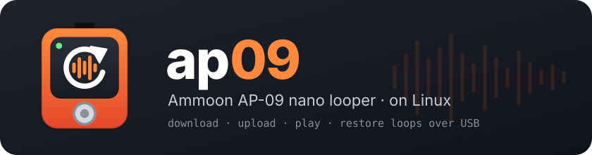
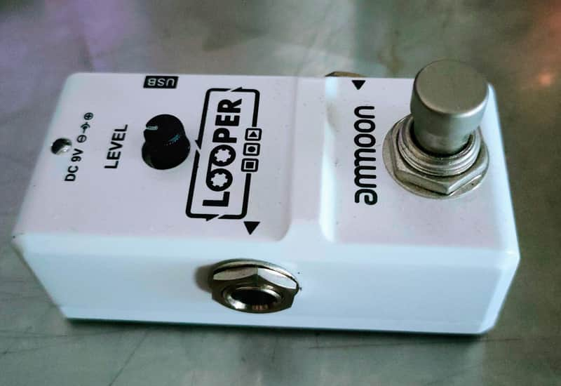
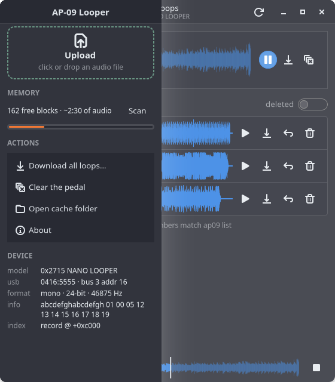

<p align="center">
  
</p>

<p align="center">
  <a href="LICENSE"></a>
  
  
  
</p>

**ap09** copies loops between an **Ammoon AP-09 nano looper** and a Linux computer over the
pedal's USB cable: download the loop as WAV, listen to it, put any audio file on the pedal,
bring back older loops still in memory. It comes as a command-line tool (`ap09`) and a
GTK 4 app (`ap09-gui`).

The pedal has no Linux software, and the existing open-source tool does not work with it.
Its USB protocol was reverse-engineered from the vendor's Windows program. Everything here
was written from scratch.

### Which pedal

<p align="center">
  
</p>

The **Ammoon AP-09** nano looper: a small white pedal with one **LEVEL** knob, a footswitch,
a 9 V jack and a **USB port** on the top. Plugged into a computer it shows up as USB ID
**`0416:5555`** (`lsusb` calls it "Winbond Electronics Corp. DFU"). Only this model has been
tested; see [Troubleshooting](#troubleshooting) for similar pedals.

---

## Features

| | Status |
|---|---|
| Download the current loop → WAV | ✅ verified bit-exact |
| List and download older loops still in memory | ✅ |
| Listen to any loop on the computer | ✅ |
| Upload WAV / MP3 / FLAC / … → pedal | ✅ bit-exact over USB · ⚠️ playback on the pedal not yet confirmed ([why](docs/PROTOCOL.md#upload-status)) |
| Cut the file before upload: start/end, or BPM × bars for a loop exactly in time | ✅ |
| Make an older loop play again (`select`) | ✅ |
| Delete loops from the list, clear the pedal | ✅ |
| Free space scan, device info | ✅ |
| Graphical app: waveforms, drag & drop upload, compact sidebar layout | ✅ |


| Narrow window, sidebar open | Upload preview with cut |
|---|---|
|  |  |
| **About** | |
|  | |

---

## Why this exists

In November 2017 I wanted to get my loops off an Ammoon AP-09 on Linux. The only
open-source tool for these cheap looper pedals was
[reinerh/loopertrx](https://github.com/reinerh/loopertrx), so I tried it. It answered
`DEVICE NOT FOUND`. I opened
**[loopertrx issue #1 — "Ammoon Looper AP-09"](https://github.com/reinerh/loopertrx/issues/1)**
with the `lsusb` and kernel output. It never got a reply and is still open.

Years later I looked again at why it could not work. There were two reasons, and only the
first one is easy to fix:

1. **Wrong USB ID.** `loopertrx` was written for the Harley Benton Mini Looper and looks
   for USB ID `0483:572a`. The AP-09 is `0416:5555` (a Rowin OEM chip that shows up as
   "Winbond … DFU"), so the device is never found.
2. **Wrong protocol.** With the ID patched in, `loopertrx` finds the pedal but its
   handshake times out. `loopertrx` speaks a mass-storage-style protocol (`USBC` command
   blocks over bulk endpoints). The AP-09 is a **USB-MIDI device** that talks **SysEx**.
   A later report on the same chip,
   [loopertrx issue #6](https://github.com/reinerh/loopertrx/issues/6) (Rowin Twin
   Looper), showed one working SysEx message, and nothing more.

The vendor's own software ("LooperSuite") is Windows-only and crashes under Wine. So I
disassembled it, worked out the SysEx packet format, the pedal's flash commands, the NAND
layout and the loop index, tested every step live on the pedal, and wrote a new tool around
that. The details are in [docs/PROTOCOL.md](docs/PROTOCOL.md).

> Issue #1 stays the starting point: if you arrive here from it, **this is the answer**.

---

## Install

### Quick install (Debian, Ubuntu, Mint, …)

```sh
git clone https://github.com/wdog/ap09-tool.git
cd ap09-tool
./install.sh
```

The script asks before each step that needs `sudo`. It:

1. offers to install the system packages that are missing
   (`python3-usb pipx ffmpeg python3-gi gir1.2-gtk-4.0 gir1.2-adw-1 gir1.2-gstreamer-1.0 gstreamer1.0-plugins-good python3-numpy`);
2. installs the `ap09` and `ap09-gui` commands with `pipx` into `~/.local/bin`;
3. adds **AP-09 Looper** with its icon to the app menu;
4. installs the udev rule `/etc/udev/rules.d/60-ap09.rules`, so the pedal works without
   `sudo`. Unplug and replug the pedal afterwards.

Options: `./install.sh --no-udev` skips the udev rule, `./install.sh --uninstall` removes
everything it installed. To upgrade, `git pull` and run `./install.sh` again.

### Manual install / other distributions

The CLI only needs Python ≥ 3.11 and [pyusb](https://pypi.org/project/pyusb/); `ffmpeg` is
used to convert non-WAV files on upload. The GUI also needs PyGObject with GTK 4,
libadwaita ≥ 1.5, GStreamer (with the "good" plugins) and numpy. Take those from your
distribution, then:

```sh
pipx install --system-site-packages .       # or: pip install --user .
sudo install -m644 data/60-ap09.rules /etc/udev/rules.d/
sudo udevadm control --reload && sudo udevadm trigger
```

| distribution | packages |
|---|---|
| Debian / Ubuntu | `python3-usb pipx ffmpeg python3-gi gir1.2-gtk-4.0 gir1.2-adw-1 gir1.2-gstreamer-1.0 gstreamer1.0-plugins-good python3-numpy` |
| Fedora | `python3-pyusb pipx ffmpeg python3-gobject gtk4 libadwaita gstreamer1-plugins-good python3-numpy` |
| Arch | `python-pyusb python-pipx ffmpeg python-gobject gtk4 libadwaita gst-plugins-good python-numpy` |

### Run from the source folder, without installing

```sh
python3 ap09.py info
python3 ap09_gui.py
```

---

## Quick start

Plug the pedal in with its USB cable. No special mode is needed.

```sh
ap09 info                     # what is on the pedal
ap09 download myloop.wav      # save the current loop
ap09 upload song.mp3          # put an audio file on the pedal
```

After `upload`, `select`, `delete` or `clear`, **unplug and replug the pedal** so it loads
the change. Or open **AP-09 Looper** from the app menu and do the same with the mouse.

---

## The app (`ap09-gui`)

- **Detects the pedal** when you plug it in (checks every 2 s).
- **Sidebar**: **Upload** (click or drop a file), free-space scan (about 4 min) with a
  level bar, actions (download all loops to a folder, clear, open the cache folder, about)
  and device details. On a narrow window it folds away: open it with the sidebar button
  or **F9**.
- **On the pedal**: the current loop with length, waveform, ▶ play, 💾 save as WAV,
  ✖ clear.
- **Upload**: drag an audio file anywhere onto the window, or click **Upload** in the
  sidebar (Ctrl+O). You see a preview with waveform and length, then confirm. There you
  can **cut** the file: set start/end (or click the waveform), or give a BPM and a number
  of bars so the loop is exactly that long; ▶ plays the cut looped. Progress with % and
  ETA, and a safe Cancel.
- **Loops**: every older loop with its state, a small waveform, ▶, 💾, ↩ put on pedal
  and 🗑 delete.
- **Player bar**: play/pause, click the waveform to seek, stop.
- Keys: **F5** refresh · **F9** sidebar · **Space** play/pause · **Ctrl+O** upload.

All pedal access runs on one background thread, so the window never freezes.

---

## The command line (`ap09`)

Run `ap09 -h` or `ap09 COMMAND -h` for all options.

| command | what it does |
|---|---|
| `ap09 info` | device, model and current loop |
| `ap09 list [--all]` | current loop and older loops in memory (`--all` shows deleted ones) |
| `ap09 play [-r N]` | listen on the computer (current loop, or loop `#N`) |
| `ap09 download [-r N] FILE.wav` | save a loop as WAV; `-a DIR` saves all of them |
| `ap09 upload FILE` | put any audio file on the pedal |
| `ap09 select N` | make loop `#N` the one the pedal plays |
| `ap09 delete N` | remove loop `#N` from the list |
| `ap09 clear` | leave the pedal without a loop |
| `ap09 space` | count free memory (full scan, about 4 min) |
| `ap09 about`, `ap09 -V` | version, author, license |

### Show what is on the pedal

```
$ ap09 info
device  0416:5555  bus 3 addr 16
model   0x2715 NANO LOOPER
info    abcdefghabcdefgh 01 00 05 12 13 14 15 16 17 18 19
format  mono  24-bit  46875 Hz
loop    ▶ 19.91 s
size    2799858 B  22 blocks  first 1661
index   record @ +0xc000  seq 0x696
```

### List the loops

The pedal plays **one** loop. Its index also remembers the loops you recorded before, and
their audio usually stays in memory until it gets reused. Loop numbers never change.

```
$ ap09 list
▶ playing #3  19.91 s

 #    length  blocks  state
 0   13.93 s      15  ● in memory
 1    7.94 s       9  ⚠ damaged 3/9
 3   19.91 s      22  ▶ playing
```

| icon | state | meaning |
|---|---|---|
| ▶ | playing | the loop the pedal plays |
| ● | in memory | older loop, audio still there: `download -r N`, `select N` |
| ⚠ | damaged N/M | older loop, N of M blocks overwritten by a later loop |
| ✖ | deleted | removed with `clear` / `delete` (shown with `list --all`) |
| ■ | no loop | pedal empty or cleared |

Colours are used on a terminal; set `NO_COLOR=1` to turn them off.

### Download

```sh
ap09 download myloop.wav          # current loop
ap09 download -r 3 old3.wav       # loop #3 from 'list'
ap09 download -a myloops/         # every loop into a folder
```

About 12 s for a 20 s loop. The file is exactly what the pedal stores:
**WAV, mono, 24-bit PCM, 46875 Hz** (the pedal's native rate, 12 MHz / 256). Any audio
program opens it. To convert:

```sh
ffmpeg -i myloop.wav -ar 48000 myloop-48k.wav      # 48 kHz
ffmpeg -i myloop.wav -b:a 320k myloop.mp3          # mp3
```

### Upload

```sh
ap09 upload song.mp3
```

- Any format ffmpeg reads works. It is converted to **mono, 24-bit, 46875 Hz**; stereo is
  mixed down. A WAV already in that format is sent as is.
- Maximum about 10 minutes (650 blocks). The real limit is how many **empty** memory
  blocks the pedal has left, see `ap09 space`. If there are not enough, the upload stops
  **before writing anything**.
- The previous loop is not deleted: it stays in `list`, and `select` brings it back.
- Speed: about 1 s per second of audio.

Cut the file first, to the exact sample, for a loop that is precisely in time
(times are seconds or `m:ss.mmm`):

```sh
ap09 upload song.wav --start 1:02.345 --end 1:10.345
ap09 upload song.wav --start 3.21 --length 8
ap09 upload song.wav --start 3.21 --bpm 120 --bars 4    # 4 bars of 4/4 = 8.000 s
```

`--beats N` changes the beats per bar (default 4).

### Bring back, delete, clear

```sh
ap09 select 3       # loop #3 plays again (no audio is copied, only the index changes)
ap09 delete 2       # hide loop #2 from the list (asks first; -y to skip)
ap09 clear          # the pedal has no loop (asks first; -y to skip)
ap09 list --all     # deleted loops are still there, marked ✖; 'select' restores them
```

The pedal ignores the erase command over USB, so audio is never really wiped: `delete`
only hides a loop, and it can be restored until its memory is reused.

### Free space

```
$ ap09 space
free    162 blocks  ~151 s of audio
max     151 s per upload (pedal limit 10 min)
slots   29 free in the index (upload/select/clear use 1)
```

### Debug commands

```sh
ap09 dump 1 0xF780000 0x60      # raw memory read: area, address, length
ap09 probe 11                   # raw command (hex) + optional hex body
```

---

## CLI and GUI are the same tool

Both use the functions in `ap09.py`. They share loop numbers, state names and icons, and
the audio cache in `~/.cache/ap09/`: a loop read by one is not read over USB again by the
other.

| | `ap09` | `ap09-gui` |
|---|---|---|
| device + current loop | `info` | "On the pedal" card, sidebar → Device |
| list loops | `list` | "Loops" list |
| show deleted loops | `list --all` | "deleted" switch |
| listen | `play [-r N]` | ▶ buttons + player bar |
| save as WAV | `download`, `download -a DIR` | 💾, sidebar → Download all |
| upload | `upload FILE [--start --end --bpm --bars]` | Upload / drag & drop, cut in the preview |
| make a loop play again | `select N` | ↩ put on pedal |
| delete from the list | `delete N` | 🗑 |
| leave the pedal empty | `clear` | ✖, sidebar → Clear |
| free space | `space` | sidebar → Memory → Scan |

The pedal serves **one program at a time**: don't run `ap09` while the app is working on it.

---

## Troubleshooting

| message / symptom | fix |
|---|---|
| `permission denied` | install the udev rule (`./install.sh`, or see [Manual install](#manual-install--other-distributions)) and replug, or use `sudo` |
| `looper 0416:5555 not found` | check the cable (some are charge-only) and `lsusb \| grep 0416:5555` |
| `pedal busy` | another `ap09` or the app is using the pedal; wait for it to finish |
| `not enough empty memory` | fewer free blocks than the file needs; try a shorter file (see `ap09 space`) |
| `loop index block is full` | record any loop on the pedal once, so it compacts its index |
| the pedal still plays the old loop | unplug and replug it after every change |
| `ap09: command not found` | run `pipx ensurepath` and open a new terminal |

Only the AP-09 (model `0x2715`, "NANO LOOPER") has been tested. Other Rowin-made loopers
with USB ID `0416:5555` (sold as Ammoon, Donner, FAME, Rowin, …) may use the same protocol
with a different memory layout. Reports are welcome in the issues.

---

## How it works

In short: the pedal is a USB-MIDI device. Every command is a packet
`00 59 | cmd | len | body | checksum`, packed into 7-bit bytes and wrapped in a SysEx
message `F0 … F7`. There are commands to read, write, erase and checksum the internal
flash and a 256 MiB NAND. Loops are raw 24-bit PCM in 128 KiB NAND blocks, and a log of
index records in block 1980 says which blocks make up each loop.

Full write-up — packet format, command table, NAND layout, index record, upload algorithm,
open questions: **[docs/PROTOCOL.md](docs/PROTOCOL.md)**.

## Project layout

| path | |
|---|---|
| `ap09.py` | CLI and core library: transport, protocol, index, download, upload, select, clear, space |
| `ap09_gui.py` | GTK 4 / libadwaita app on top of `ap09.py` |
| `install.sh` | user install / uninstall (pipx, app menu entry, udev rule) |
| `pyproject.toml` | Python packaging: `ap09` and `ap09-gui` entry points |
| `data/` | app icon, `.desktop` entry, udev rule |
| `docs/` | protocol notes, logo, screenshots |

Lint: `ruff check .`

## Credits

- [Reiner Herrmann's loopertrx](https://github.com/reinerh/loopertrx), where this started
  ([issue #1](https://github.com/reinerh/loopertrx/issues/1)).
- The reporter of [loopertrx issue #6](https://github.com/reinerh/loopertrx/issues/6), for
  the first working SysEx message.

## Author and license

**wdog** — <wdog666@gmail.com>

Released under the [MIT License](LICENSE): you may use, copy, modify, improve and
redistribute this software, provided that **the copyright notice with the author's name
(`Copyright (c) 2026 wdog <wdog666@gmail.com>`) and the license text are kept** in all
copies and derivative works.

Not affiliated with Ammoon or Rowin. The protocol was reverse-engineered for
interoperability; use at your own risk.
