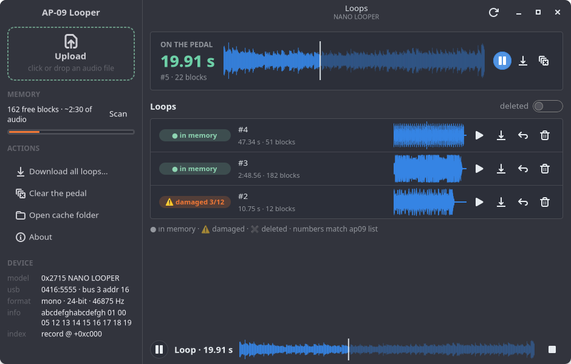
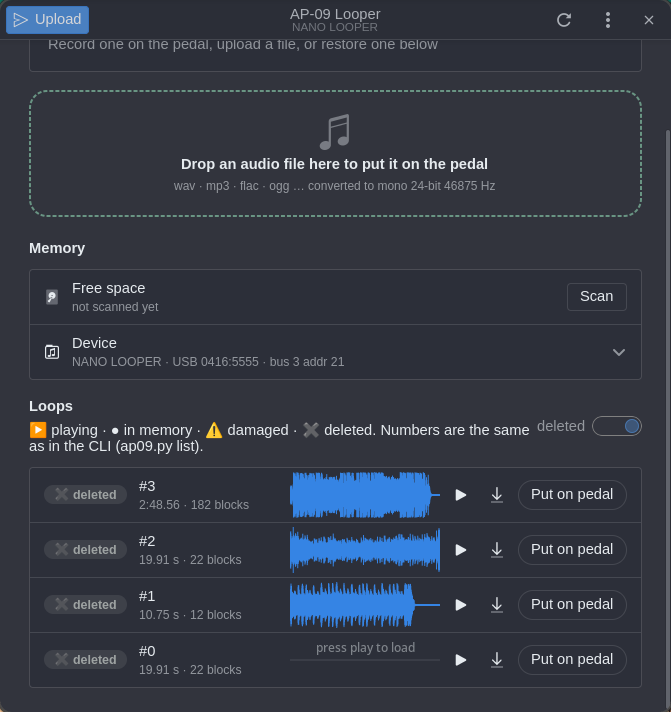
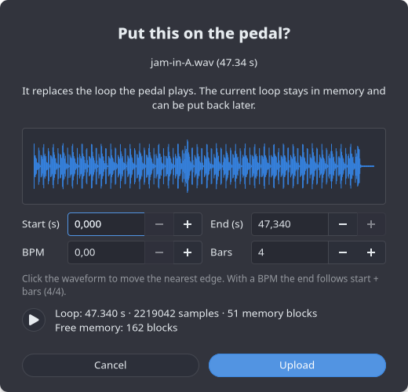
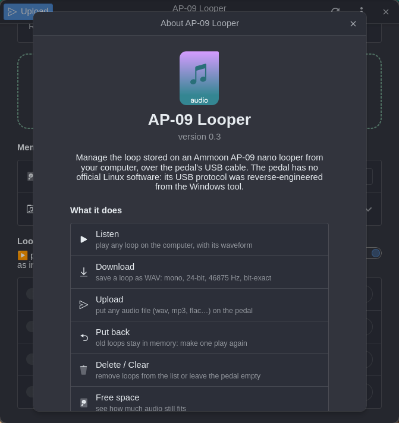

# ap09 — Ammoon AP-09 nano looper on Linux

A command-line tool to copy loops between an **Ammoon AP-09 nano looper**
(USB ID `0416:5555`, Rowin OEM chip) and your computer over USB.

| Feature | Status |
|---|---|
| Download the loop → WAV | ✅ works, verified bit-exact |
| List / download older loops | ✅ works |
| Show device/loop info | ✅ works |
| Upload WAV/MP3/… → pedal | ✅ bit-exact over USB — ⚠️ playback on the pedal not yet confirmed (see [Upload status](#2-upload-status)) |
| Make an older loop current (`select`) | ✅ writes the index record; playback not yet confirmed |

Versions: tag `v0.1-download` = download only. Branch `upload` = download + upload.

---

## 0. Graphical app (GTK4)

```
python3 ap09_gui.py
```

| Main window | Loops (with deleted shown) |
|---|---|
|  |  |
| **Upload preview** | **About** |
|  |  |

Requirements (Debian/Ubuntu), in addition to `python3-usb` and `ffmpeg` from the CLI
section:

```
sudo apt install python3-gi gir1.2-gtk-4.0 gir1.2-adw-1 \
                 gir1.2-gstreamer-1.0 gstreamer1.0-plugins-good python3-numpy
```

| package | used for |
|---|---|
| `python3-gi`, `gir1.2-gtk-4.0`, `gir1.2-adw-1` | the window (GTK 4 + libadwaita ≥ 1.5 for dialogs) |
| `gir1.2-gstreamer-1.0`, `gstreamer1.0-plugins-good` | playing loops on the computer |
| `python3-numpy` | waveforms |
| `python3-usb` | talking to the pedal |
| `ffmpeg` | converting mp3/flac/… on upload |

What it does:

- **Detects the pedal automatically** when you plug it in (it checks every 2 s).
- **On the pedal** card: the current loop with its length, waveform, ▶ play,
  💾 save as WAV, ✖ clear.
- **Upload**: drag an audio file onto the window, or click the drop zone / **Upload**
  (Ctrl+O). A preview with the waveform and length comes first, then a confirmation.
  There you can **cut** the file: set start/end (or click the waveform), or give a BPM and
  a number of bars so the loop is exactly that long; ▶ plays the cut looped.
  Progress shows under the header bar.
- **Loops in memory**: every older loop with a state badge (in memory / damaged),
  a small waveform, ▶ play, 💾 save, and **Put on pedal** (`select`).
- **Player bar** at the bottom: play/pause, click the waveform to seek, stop.
- **Memory**: free space scan (about 4 min) with a level bar, device info.
- Menu: scan space, clear, download all loops to a folder, open the cache.
- Keys: **F5** refresh, **Space** play/pause, **Ctrl+O** upload.

Audio loaded from the pedal is cached in `~/.cache/ap09/`, so it is read over USB only
once. All pedal access goes through one background thread, and the window never
freezes. **Don't run the CLI while the app is working on the pedal**: the pedal serves
one client at a time.

Launcher for the app menu (optional):

```
sed "s#@DIR@#$PWD#g" ap09-gui.desktop > ~/.local/share/applications/ap09-gui.desktop
```

### CLI and GUI do the same things

Both are built on the same functions in `ap09.py`. They share loop numbers, state
names and icons, time format, and the audio cache (`~/.cache/ap09`). A loop read by
one does not have to be read from the pedal again by the other.

| | CLI (`ap09.py`) | GUI (`ap09_gui.py`) |
|---|---|---|
| device + current loop | `info` | "On the pedal" card + Device (expand) |
| list, stable numbers `#N` | `list` | "Loops" list |
| show deleted loops | `list --all` | "deleted" switch |
| listen | `play [-r N]` | ▶ buttons + player bar |
| save as WAV | `download [-r N] file`, `download -a dir` | 💾 buttons, menu "Download all" |
| upload | `upload file` | Upload button / drag & drop |
| make a loop play again | `select N` | "Put on pedal" |
| delete from the list | `delete N` | 🗑 button |
| leave the pedal empty | `clear` | ✖ on the card / menu "Clear" |
| free space | `space` | Memory → Scan |
| author, license | `about`, `-V` | menu → About |

States: **▶ playing** · **● in memory** · **⚠ damaged N/M** · **✖ deleted**

---

## 1. How to use it

### Requirements

```
sudo apt install python3-usb ffmpeg     # ffmpeg only needed to upload non-native audio
```

Plug the pedal into the computer with its USB cable. It does not need to be switched to
any special mode.

### Show what is on the pedal

```
sudo python3 ap09.py info
```

```
device  0416:5555  bus 3 addr 16
model   0x2715 NANO LOOPER
info    abcdefghabcdefgh 01 00 05 12 13 14 15 16 17 18 19
format  mono  24-bit  46875 Hz
loop    ▶ 19.91 s
size    2799858 B  22 blocks  first 1661
index   record @ +0xc000  seq 0x696
```

### List the loops

The pedal plays **one** loop, the current one. Its index also keeps the loops you
recorded before, and their audio usually stays in memory until it gets reused:

```
sudo python3 ap09.py list
```

```
 #  length   blocks  first  note
 0   13.93s      15   1536  old loop, probably intact
 ...
 8   19.91s      22   1661  CURRENT (the loop the pedal plays)
```

### Download a loop

```
sudo python3 ap09.py download myloop.wav          # current loop
sudo python3 ap09.py download -r 3 old3.wav       # loop #3 from 'list'
sudo python3 ap09.py download -a myloops/         # all of them into a folder
```

It takes about 12 s for a 20 s loop. The file you get is exactly what the pedal stores:

- **WAV, mono, 24-bit signed PCM, 46875 Hz** (the pedal's native rate, 12 MHz / 256).

Every audio program opens it. To turn it into a more common format:

```
ffmpeg -i myloop.wav -ar 48000 myloop-48k.wav      # resample to 48 kHz
ffmpeg -i myloop.wav -b:a 320k myloop.mp3          # mp3
```

### Upload a loop

```
sudo python3 ap09.py upload song.mp3
```

Then **unplug and replug** the pedal so it loads the new loop.

Cut the file first, to the exact sample, for a loop that is precisely in time
(times are seconds or `m:ss.mmm`):

```
sudo python3 ap09.py upload song.wav --start 1:02.345 --end 1:10.345
sudo python3 ap09.py upload song.wav --start 3.21 --length 8
sudo python3 ap09.py upload song.wav --start 3.21 --bpm 120 --bars 4    # 4 bars of 4/4 = 8.000 s
```

`--beats N` changes the beats per bar (default 4).

- The input can be anything ffmpeg reads (wav, mp3, flac, ogg, …). It is converted
  automatically to the pedal's format: **mono, 24-bit, 46875 Hz**. A WAV that is already
  in that format is sent as is, without ffmpeg.
- Stereo is mixed down to mono. The end is padded with silence to a multiple of 62
  samples (1.3 ms).
- Maximum length is about 10 minutes (650 blocks). In practice the limit is how many
  **empty** memory blocks the pedal has (see [Upload status](#2-upload-status)).
- The upload replaces the current loop. The old loop is not deleted: it stays in `list`,
  and you can bring it back with `select`.
- Speed: about 1 s per second of audio.

To produce the exact format yourself:

```
ffmpeg -i song.mp3 -ac 1 -ar 46875 -c:a pcm_s24le song-ap09.wav
```

### Remove the loop

```
python3 ap09.py clear          # asks for confirmation; -y to skip it
```

The pedal ends up with no loop, and that loop **disappears from `list`**. The clear
record names the loop it removes, the same way the pedal's own clear records do.

### Delete a loop from the list

```
python3 ap09.py delete 2       # asks for confirmation; -y to skip it
python3 ap09.py list --all     # also shows deleted loops (✖)
python3 ap09.py select 3       # bring a deleted loop back (numbers never change)
```

The audio cannot be wiped over USB (the erase command is ignored). It stays in memory
until it gets reused, and `delete` only hides it. Deleting the playing loop is the same
as `clear`. Deleting an old loop uses 2 index slots, because the playing loop is
re-selected right after (the pedal only looks at the newest record).

### What `list` shows

```
▶ playing #3  19.91 s

 #    length  blocks  state
 0    13.93 s     15  ● in memory
 1     7.94s       9  ⚠ damaged 3/9
 3    19.91s      22  ▶ playing

▶ playing   loop the pedal plays now
● in memory  old loop, not playing, audio still in memory
⚠ damaged   old loop, N/M blocks overwritten by a later one
  history stays until the pedal compacts its index (seen when the log was half full)
```

The legend lists only the states that appear.

Colours are used on a terminal; set `NO_COLOR=1` to turn them off.

| icon | state | meaning |
|---|---|---|
| ▶ | playing | the loop the pedal plays |
| ● | in memory | older loop, audio still in memory: `download -r N` / `select N` |
| ⚠ | damaged | older loop, N/M blocks overwritten by a later loop |
| ✖ | deleted | removed with `clear`/`delete` (only with `list --all`) |
| ■ | no loop | pedal empty or cleared |


### How much space is left

```
python3 ap09.py space          # full scan, ~4 min
```

```
free    162 blocks  ~151 s of audio
max     151 s per upload (pedal limit 10 min)
slots   29 free in the index (upload/select/clear use 1)
```

`upload` checks by itself too. It first reserves all the empty blocks it needs, and if
they are not enough it stops **without writing anything** (`not enough empty memory:
need N blocks …, found M`). If the index is full it stops before writing as well.

### Bring back an older loop

```
sudo python3 ap09.py list
sudo python3 ap09.py select 8        # loop #8 becomes the current one again
```

Unplug and replug afterwards. `select` does not copy any audio: it only adds an index
record that points at the old loop's memory blocks. The index is append-only, so every
`select` adds a record, but `list` merges records that point at the same audio: each loop
appears only once. `select` on the loop that is already playing writes nothing. That only works while those blocks
have not been reused (`list` tells you).

### Running without sudo

Create `/etc/udev/rules.d/99-ap09.rules`:

```
SUBSYSTEM=="usb", ATTRS{idVendor}=="0416", ATTRS{idProduct}=="5555", MODE="0666"
```

Then run `sudo udevadm control --reload && sudo udevadm trigger` and replug the pedal.

### Debug commands

```
sudo python3 ap09.py dump 1 0xF780000 0x60      # raw memory read: area, address, length
sudo python3 ap09.py probe 11                   # raw command (hex) + optional hex body
```

`backup-original-loop.wav` is a copy of the loop that was on the pedal when this tool
was developed.

---

## 2. Upload status

**Works over USB, verified bit-exact** (upload a 5 s tone, download it again: identical).
**Not yet confirmed:** that the pedal plays an uploaded loop after a replug. If it does not,
the first suspects are record byte 0x07 and the sequence number at 0x0A, which the
official tool leaves as 0xFF / 0 while the pedal fills them in (see the index section).

### Why the upload works differently from the official tool

The official tool erases blocks and then writes them. On this pedal **the erase command
(0x21) replies "OK" and does not erase anything**. Tests:

- Erasing a block that holds data, then reading it back (same session, pages never read
  before, even after the 0x11 handshake) shows the old data is still there.
- Writing (0x22) works, but only on pages that are already `FF`. On used pages the new
  data comes out **ANDed** with the old, which is typical NAND behaviour when you program
  without erasing first.

- Also tried, none of which erases: address as block number, page number, `addr>>9`,
  `>>10`, `>>12`, `>>16`; blocks above and below 1536; erase immediately followed by a
  write (to rule out a lazy erase).

**Workaround used by `ap09.py upload`** (`upload_loop()`):

1. Walk the blocks in the same order as the official tool (random start, going up,
   wrapping) and skip blocks referenced by any record in the index.
2. Still send erase (harmless, and useful if some firmware honours it). Then use the block
   only if it is **really empty**: device checksum 0x24 over 0x1FFFF bytes == `0xFF01`
   (all FF) and the first 16 bytes read as FF. Otherwise skip it. Checking one block takes
   about 0.1 s.
3. Write the pages (0x22), then verify the whole block with 0x24 against the expected
   image (data plus FF for the spare bytes and unused pages). On a mismatch, mark the
   block as used and take another one.
4. Write the index record into the next **empty** 2-page slot of the index block (checked
   the same way) and read it back.

**Limits that follow from this:**

- Capacity = number of empty blocks. Measured on this unit: of the first 1024 blocks
  about 200 had an FF first page. In a test upload, 8 of 14 candidates were already
  used.
- **Index compaction by the pedal.** Once, at power-on, with the log filled up to
  slot 32 of 64, the pedal erased the index block itself and wrote a single record
  with the current state (`looper\0 ff <valid> ff 00 00`, block list zeroed). So its
  internal erase works, and compaction frees the slots and wipes the history. A later
  restart with only 3 records **did not** compact, so the trigger is probably the fill
  level, not the restart itself (unconfirmed). The old audio blocks stay untouched.
- The index block cannot be erased over USB. It has 32 record slots (the unit had 15 used, then
  17). When it is full, upload/select stop with "loop index block is full; record any loop
  on the pedal once". Assumption (untested): the pedal erases or rotates its own index
  when it needs to.

### Development history

A first upload (erase + write, like the official tool) produced a corrupted loop, because
the new data got ANDed with the old. The original loop was still intact (erase does
nothing), so it was restored by appending a record that points at its old blocks. That is
what `select` does now. The restore was verified bit-exact against
`backup-original-loop.wav`.

---

## 3. How it works (technical)

### How it was reverse-engineered

1. `lsusb` shows `0416:5555 Winbond ... "DFU"`, manufacturer "Rowin". The name "DFU" is
   misleading: it is not a bootloader.
2. Issue [reinerh/loopertrx#6](https://github.com/reinerh/loopertrx/issues/6) showed that
   the device talks MIDI SysEx and gave one working message
   (`F0 00 32 45 00 00 00 40 7F F7`). The upstream `loopertrx` protocol (mass-storage
   style) does **not** apply to this chip.
3. The official Windows software, "LooperSuite V1.7" (`Looper+software+1.7.exe`,
   installer from rowinmusic.com), crashes under Wine. So the installed
   `Looper Software.exe` (Qt5 + RtMidi, 32-bit) was **disassembled statically with
   `objdump -d`**. Protocol functions were found from their strings
   (`CUSBConnect::flash_read failed`, `get_upload_responds::Checksum error!`), from the
   constant `0xF0`, and by following call chains.
4. Every hypothesis was tested live on the pedal with small Python scripts.

Addresses below are virtual addresses in `Looper Software.exe` (image base 0x400000,
file size 620544 bytes, dated 2019-02-20).

### Transport

- USB interface 1 (Audio / MIDIStreaming, string "DFU-Midi"), bulk endpoints `0x02` OUT
  and `0x81` IN, 64-byte packets. The kernel's `snd-usb-audio` claims it. The tool
  detaches it and gives it back at the end. (The same messages also work through ALSA:
  `amidi -p hw:X,0,0 -S "<hex>" -r out.syx`.)
- Bytes travel in **USB-MIDI event packets**: `[CIN][b0][b1][b2]` on cable 0. CIN 0x4 =
  SysEx start/continue; 0x5/0x6/0x7 = SysEx end with 1/2/3 bytes.
- A reply can span many bulk reads, so the tool reads until it sees `F7`.

### SysEx framing

`F0 <packed> F7`, with **no manufacturer ID**. The payload is packed into 7-bit bytes as
a little-endian bitstream (encoder `0x410a80`, decoder `0x4108a0`). See `pack7` /
`unpack7` in `ap09.py`. What looks like a Rowin ID (`00 32 45`) is only packed data.

### Packet format (after unpacking)

```
00 59 | cmd | len (LE24) | body[len] | checksum = ~sum(body) & 0xFF   (0xFF if body empty)
```

Header `00 59` is the constant at `0x48ea78`. Replies use the same format. Commands that
answer with a status use reply cmd `0x00` with a 1-byte body: `00` = OK, anything else =
error (for example `00 59 00 01 00 00 01 FE` is error 1).

| cmd | body | reply | where in the exe | status |
|---|---|---|---|---|
| `0x11` info | – | 27 bytes (`"abcdefgh" "abcdefgh" 01 00 05 12..19`), static | `0x4189e0` | ✅ |
| `0x23` read | `area:u8 addr:LE32 len:LE24` | echo of the 8-byte body, then `len` bytes | `0x418f80` | ✅ |
| `0x22` write | `area addr:LE32 len:LE24 data` (≤0x1400 per packet) | status | `0x418c60` | ✅ (programs only, needs FF) |
| `0x21` erase | `area addr:LE32` | status (always OK) | `0x4191b0` / `0x418bc0` | ❌ no effect on this firmware |
| `0x24` checksum | `area addr:LE32 len:LE32` | reply cmd 0x24: echo of the 9-byte body + `u16` LE sum of the bytes | `0x419220` / `0x418ea0` | ✅ (~0.1 s per 128 KiB) |

Read chunks are capped at 0x3F1 bytes (the official tool's limit), writes at 0x1400.
Areas: **0** = MCU internal flash (firmware, settings; never write here), **1** = 256 MiB
NAND. Area 2 returns an error.

The official tool also has an older fallback protocol for other models: raw 4-byte
commands `59 12 00 34`, `59 13..1e 00 00`, `59 21 00 21` (`0x418b60`, `0x4186a0`). This
unit does not answer them.

### Device / model

Reading area 0 at `0x2180` (16 bytes) → bytes 4..7 = model id **0x2715 = "NANO LOOPER"**
(model table at `0x48e700`, entries of 0x54 bytes). The per-model NAND layout table is at
`0x48ea20` (11 × u32), copied into the song object by `0x408200`:

| field | value | meaning |
|---|---|---|
| base | 0 | NAND base offset |
| index block | 0x7BC (1980) | block that holds the loop index log |
| max blocks | 0x28A (650) | max blocks per loop, about 10 min |
| block size | 0x20000 | 128 KiB |
| page size | 0x800 | 2 KiB |
| pages/block | 0x40 | 64 |
| audio/page | 0x7FE | 2046 audio bytes per page; the last 2 bytes are spare (`00 00`) |
| rate | 0xB71B | 46875 Hz |
| channels | 1 | mono |
| bits | 0x18 | 24-bit signed LE |
| tail unit | 0xBA | 186 bytes (62 samples), length granularity; 11 per page |

### Loop index (NAND block 1980, address `0xF780000`)

This is a log of records. A new record goes every 2 pages (0x1000 bytes). The **newest**
record is the current loop. When the block is full, the official tool erases it and starts
again at page 0 (`0x407cfa`). Record (0xA40 bytes, built at `0x407c1e`, read at
`0x407ff0`):

```
0x00  "looper\0"
0x07  u8   written by the pedal (maybe a checksum); the PC tool leaves it 0xFF
0x08  u8   1 = valid loop, 0 = no loop (cleared)
0x09  u8   0xFF
0x0A  u16  sequence number (pedal counts up; PC tool writes 0)
0x0C  u16  A  \
0x0E  u8   B   }  units = A*704 + B*11 + C  (units of 186 bytes, minus one)
0x0F  u8   C  /   length_bytes = (A*64 + B)*2046 + (C+1)*186
0x10  u16[] NAND block numbers of the loop, in order (ceil(length / 130944) entries)
0xA38 "looper\0"  (trailer written by the PC tool)
```

### Audio layout

The loop is the concatenation of 2046-byte chunks. Chunk *k* of a block is stored at
`block*0x20000 + page*0x800`, where `page = k` in every block **except the first block of
the loop**. That one is rotated by one page: chunk 0 → page 63, chunk k → page k−1
(`0x408900` download, `0x408b54` upload). The data is raw 24-bit LE mono PCM at 46875 Hz.

### Upload algorithm of the official tool (for reference)

1. Pick blocks: start at a random block (`rand() % 1980`), go up and wrap around, and skip
   blocks used by existing songs (`0x406ca0`).
2. For each block: erase (0x21), then write each 2046-byte chunk into its page (0x22),
   padding the last chunk to a multiple of 186 bytes. Verify each write with 0x24
   (`0x418ea0`).
3. Build the record (0xFF-filled, fields above) and write it into the next free record slot
   of the index block. If there is no free slot, erase the index block first.

### Where to continue

- **Confirm playback** of an uploaded loop on the pedal. If it fails, try writing record
  byte 0x07 and the sequence number (0x0A) the way the pedal does. Byte 0x07 is not a
  simple sum/xor of the record (checked by brute force over all ranges).
- **Make erase work** (it would lift the empty-block limit). Every packet builder in the
  exe starts by loading the `00 59` header (`grep -n "0x48ea78"` on the disassembly):
  `0x407470` read, `0x407d1a` erase (index), `0x408e16` erase (old song type), `0x4189ee`
  info, `0x418cd8` write, `0x41900f` read, `0x4191b0` erase, `0x419220` checksum. There
  is no other command, so erase is probably disabled in this firmware version, or allowed
  only in a device state not reached yet (for example with the pedal stopped or in a
  special mode).
- Meaning of the info (0x11) bytes.
- Command to count the empty blocks (a full scan takes about 4 min at 0.1 s per block).

### Files

- `LICENSE` — MIT, © 2026 wdog.
- `ap09.py` — CLI and core library (transport, protocol, index parsing, download, upload, select, clear, space).
- `ap09_gui.py` — GTK4/libadwaita app built on `ap09.py`.
- `ap09-gui.desktop` — launcher template (`@DIR@` = project folder).
- `ruff.toml` — lint config: `ruff check .` (ruff via `pipx install ruff`).

- `backup-original-loop.wav` (not in git) — local backup of the loop that was on the pedal.
- `re/` (not in git) — `Looper Software.exe` from the official installer and its `objdump -d` output (`looper_disasm.txt`).

---

## Author and license

**wdog** — <wdog666@gmail.com>

Released under the [MIT License](LICENSE): you may use, copy, modify, improve and
redistribute this software, provided that **the copyright notice with the author's name
(`Copyright (c) 2026 wdog <wdog666@gmail.com>`) and the license text are kept** in all
copies and derivative works.

Not affiliated with Ammoon or Rowin. The protocol was reverse-engineered for
interoperability; use at your own risk.

